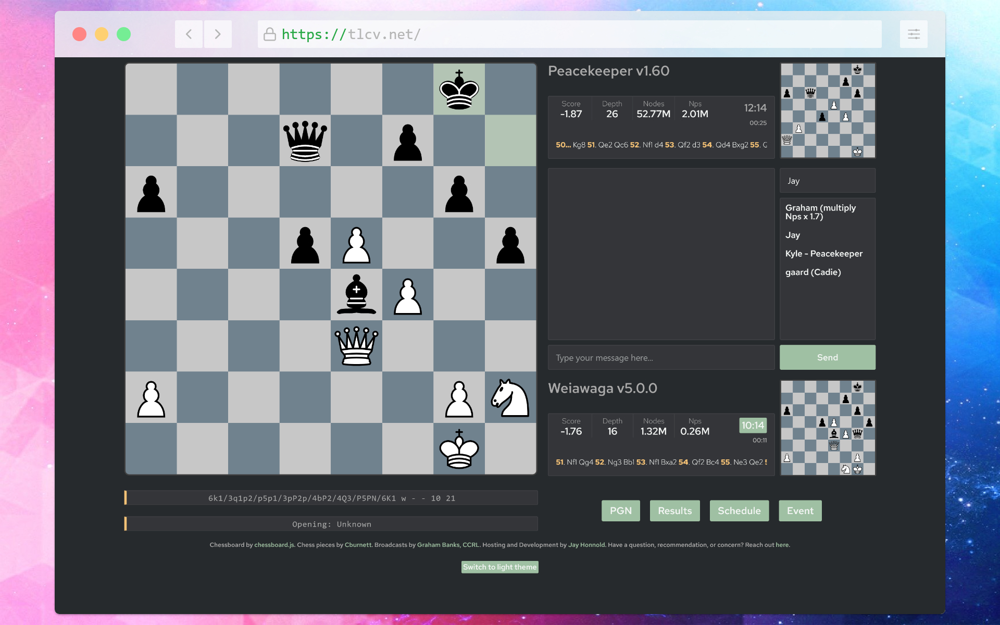

# Node TLCV

A server implementation of Tom's live chess viewer. Designed to work with Graham Bank's [CCRL](https://computerchess.org.uk/ccrl/4040/) broadcasts. Watch live at [https://ccrl.live](https://ccrl.live/)!



## Running your own

### Requirements
- Your own [Tom's live chess server](https://www.chessprogramming.org/TLCS-TLCV)
  - I do not know how TLCS is setup as I do not host any broadcasts myself
- [Node.JS](https://nodejs.org/en/)
  - [pm2](https://pm2.keymetrics.io/) if you'd like to run this in the background

### Setup
- Create a base config in `config/config.json`.
- It should be of the form: `{ connections: string[] }` where each string is `<host>:<port>`
- Create a `.env` file at the same level as this `README` and specify a `TLCV_PASSWORD`
```bash
# .env
TLCV_PASSWORD=password
```

### Compile
```bash
npm install && npm run build
```

### Start the server
- Launches on port 8080
```bash
node build/src/main.js # runs in foreground
# or
pm2 start build/src/main.js # runs in background
```

### Admin Panel
- Admin panel can be accessed at `/admin`
  - Username is `admin`
  - Password is specified by the `TLCV_PASSWORD` environment variable (see above)

