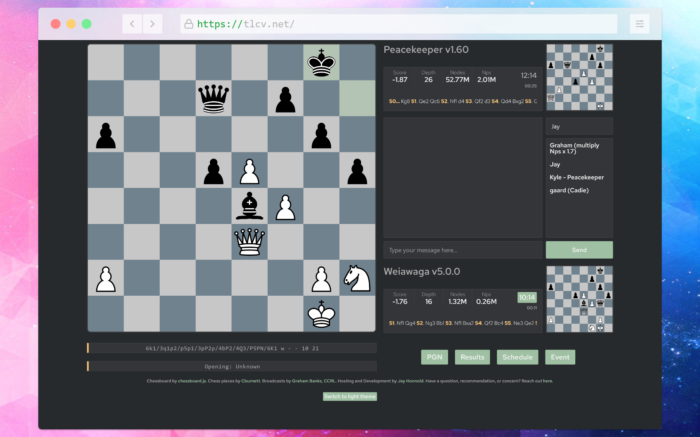

# Node TLCV

A server implementation of Tom's live chess viewer. Designed to work with Graham Bank's [CCRL](https://computerchess.org.uk/ccrl/4040/) broadcasts. Watch live at [https://ccrl.live](https://ccrl.live/)!



## Running your own

### Requirements
- Your own [Tom's live chess server](https://www.chessprogramming.org/TLCS-TLCV)
  - I do not know how TLCS is setup as I do not host any broadcasts myself
- [Node.JS](https://nodejs.org/en/) (>= 20)
  - [pm2](https://pm2.keymetrics.io/) if you'd like to run this in the background
- (Production uses systemd — see [docs/deploy.md](./docs/deploy.md))

### Setup
- Modify [config/config.json](config/config.json)
  - `connections` is an array of `"host:port"` strings (or objects) for the initial
    broadcast ports you'd like to connect to. See [docs/gotchas.md](./docs/gotchas.md)
    for the full entry format.
- Create a `.env` file at the same level as this `README` from [.env.example](.env.example)
  and specify a `TLCV_PASSWORD`
```bash
# .env
TLCV_PASSWORD=password
```
  Other optional variables (`PORT`, `CONFIG_DIR`, `PGNS_DIR`, `LOG_LEVEL`,
  `LICHESS_OAUTH_TOKEN`) are documented in [.env.example](.env.example).

### Compile
```bash
npm install && npm run build
```

### Start the server
- Launches on port 8080 by default (override with `PORT` in `.env`)
```bash
node build/src/main.js # runs in foreground
# or
pm2 start build/src/main.js # runs in background
```

### Admin Panel
- Admin panel can be accessed at `/admin`
  - Username is `admin`
  - Password is specified by the `TLCV_PASSWORD` environment variable (see above)

